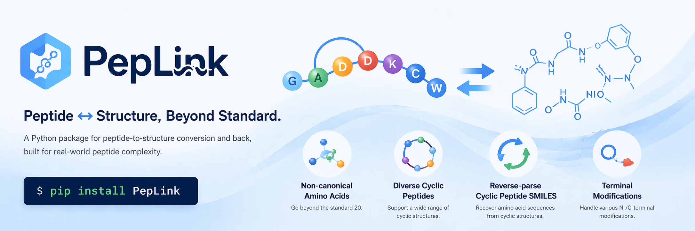

# PepLink

PepLink is a Python package for peptide-to-structure conversion.

## At A Glance

Before diving into the APIs, the fastest way to understand PepLink v1 is this:

- 420 bundled unusual amino acids (non-canonical residue mappings)
- 296 bundled terminal modifications in total
- 241 N-terminal modifications
- 55 C-terminal modifications
- 3 cyclic-peptide topology classes
- 11 implemented intrachain bond chemistries

The 3 cyclic-peptide topology classes are:

- `SSB`: sidechain-sidechain cyclization
- `SMB`: sidechain-mainchain cyclization
- `MMB`: mainchain-mainchain cyclization, including head-to-tail macrocyclization

It currently focuses on one reliable v1 scope:

- `aa_seqs_to_smiles(...)`: monomer peptide definition -> `SMILES` or `SELFIES`
- `smiles_to_aa_seqs(...)`: standard-amino-acid `SMILES` or `SELFIES` -> peptide sequence
- `list_supported_noncanonical_aas(...)`: inspect bundled and user-registered non-canonical amino-acid mappings
- `register_noncanonical_aa(...)` / `register_noncanonical_aas(...)`: register custom non-canonical amino acids for the current Python process
- `load_noncanonical_aas_from_csv(...)` / `register_noncanonical_aas_from_csv(...)`: read custom non-canonical amino acids from a user CSV file

## Installation

```bash
pip install PepLink
```

Runtime dependencies:

- `rdkit`
- `selfies`

## Quick Start

For an interactive version of the examples in this README, open [`examples/quick_start.ipynb`](examples/quick_start.ipynb).

### `aa_seqs_to_smiles(...)`

```python
from PepLink import aa_seqs_to_smiles

smiles = aa_seqs_to_smiles(
    "RRXXRF",
    unusual_amino_acids=[
        {"position": 3, "name": "1-NAL"},
        {"position": 4, "name": "1-NAL"},
    ],
    n_terminal="ACT",
    c_terminal="AMD",
)

print(smiles)
```

### `smiles_to_aa_seqs(...)`

```python
from PepLink import smiles_to_aa_seqs

result = smiles_to_aa_seqs("C[C@H](N)C(=O)N[C@@H](CS)C(=O)O")

print(result.sequence)            # AC
print(result.is_cyclic)           # False
print(result.cyclization)         # linear
print(result.unsupported_reason)  # None
```

### Non-canonical amino-acid registry

```python
from PepLink import (
    aa_seqs_to_smiles,
    list_supported_noncanonical_aas,
    register_noncanonical_aa,
)

supported = list_supported_noncanonical_aas()
print(supported["1-NAL"])

register_noncanonical_aa("MyAA", "N[C@@H](CC)C(=O)O")

smiles = aa_seqs_to_smiles(
    "AXA",
    unusual_amino_acids=[{"position": 2, "name": "MyAA"}],
)
print(smiles)
```

```python
from PepLink import register_noncanonical_aas_from_csv

register_noncanonical_aas_from_csv("examples/example_custom_noncanonical_aas.csv")
```

## Supported Scope

### `aa_seqs_to_smiles(...)`

PepLink v1 supports monomer peptides with:

- 20 canonical amino acids plus D-forms represented by lowercase one-letter codes
- 420 bundled non-canonical amino-acid mappings
- all 241 N-terminal modifications found in `all_peptides_data.json`
- all 55 C-terminal modifications found in `all_peptides_data.json`
- 3 cyclic-peptide topology classes: `SSB`, `SMB`, and `MMB`
- 11 implemented intrachain bond types

Supported intrachain bond types:

- `DSB`
- `AMD`
- `TIE`
- `DCB`
- `EST`
- `AMN`
- `p-XylB`
- `TRZB`
- `(E)-but-2-enyl-B`
- `BisMeBn-B`
- `but-2-ynyl-B`

Meaning of the supported intrachain bond abbreviations:

| Bond | Full name | Meaning |
| --- | --- | --- |
| `DSB` | Disulfide Bond | A covalent S-S linkage between two cysteine sulfur atoms. |
| `AMD` | Amide Bond | An amide linkage formed between a carboxyl group and nitrogen; in peptides this bond has partial double-bond character, so the C-N bond is not freely rotatable. |
| `TIE` | Thioether Bond | A thioether linkage with the general form `R-S-R'`. |
| `DCB` | Dicarbon Bond (C=C) | A carbon-carbon double-bond crosslink. |
| `EST` | Ester Bond | An ester linkage formed from a carboxyl group and a hydroxyl group. |
| `AMN` | Amine Bond | A bond involving an amino or amine group such as `-NH2`, `-NH-`, or `-N-`. |
| `p-XylB` | para-Xylene thioether bridge | A para-xylene-based thioether bridge that connects two residues through sulfur atoms. |
| `TRZB` | Triazole bridge | A sidechain-sidechain linkage formed through a triazole ring bridge. |
| `(E)-but-2-enyl-B` | (E)-but-2-enyl bridge | A sidechain-sidechain crosslink bridged by an `(E)-but-2-enyl` group containing a `C=C` unit. |
| `BisMeBn-B` | Bismethylenebenzene bridge | A sidechain-sidechain crosslink bridged by a benzene ring with two methylene linkers. |
| `but-2-ynyl-B` | but-2-ynyl bridge | A sidechain-sidechain crosslink bridged by a `but-2-ynyl` group containing a carbon-carbon triple bond. |

Common `chain_participating` abbreviations used in examples:

- `SSB`: Sidechain-Sidechain Bond
- `MMB`: Mainchain-Mainchain Bond
- `SMB`: Sidechain-Mainchain Bond

### `smiles_to_aa_seqs(...)`

PepLink v1 intentionally keeps reverse parsing conservative.

It officially supports:

- standard amino acids only
- L/D configuration
- linear peptides
- head-to-tail cyclic peptides
- `SMILES` input
- `SELFIES` input

It does not promise reverse parsing for:

- non-canonical amino acids
- sidechain-crosslinked cyclic peptides
- terminally modified peptides
- coordination complexes

When a molecule is outside this reliable scope, `smiles_to_aa_seqs(...)` returns a `PeptideParseResult` with `unsupported_reason`.

## Public API

### `aa_seqs_to_smiles(...)`

```python
aa_seqs_to_smiles(
    sequence,
    *,
    unusual_amino_acids=None,
    intrachain_bonds=None,
    n_terminal=None,
    c_terminal=None,
    output_format="smiles",
    aa_overrides=None,
    n_terminal_overrides=None,
    c_terminal_overrides=None,
) -> str
```

Key conventions:

- `sequence` uses one-letter amino-acid codes
- non-canonical residues are represented by `X` or `x` placeholders
- `unusual_amino_acids` must match the placeholder positions exactly
- `intrachain_bonds` can use either lightweight dicts or DBAASP-like nested dicts
- `output_format` is either `"smiles"` or `"selfies"`

Minimal direct examples:

### Linear peptide

Dataset example: `id=11`

```python
from PepLink import aa_seqs_to_smiles

smiles = aa_seqs_to_smiles("RVKRVWPLVIRTVIAGYNLYRAIKKK")
```

### Single non-canonical residue

Dataset example: `id=151`

```python
smiles = aa_seqs_to_smiles(
    "GIKEXKRIVQRIKDFLRNLV",
    unusual_amino_acids=[
        {"position": 5, "name": "Phg"},
    ],
)
```

### Multiple non-canonical residues

Dataset example: `id=157`

```python
smiles = aa_seqs_to_smiles(
    "GRFKRXRKKXKKLFKKIS",
    unusual_amino_acids=[
        {"position": 6, "name": "Phg"},
        {"position": 10, "name": "Phg"},
    ],
)
```

### Terminal modifications

Dataset example: `id=10360`

```python
smiles = aa_seqs_to_smiles(
    "K",
    n_terminal="C16",
    c_terminal="AMD",
)
```

Another real example with D-amino acids is `id=8`:

```python
smiles = aa_seqs_to_smiles(
    "KVvvKWVvKvVK",
    n_terminal="C16",
    c_terminal="AMD",
)
```

### Intrachain bond examples

Each bond type below is backed by a real record from `all_peptides_data.json`.

#### `DSB`

Dataset example: `id=57`

```python
smiles = aa_seqs_to_smiles(
    "VTCDILSVEAKGVKLNDAACAAHCLFRGRSGGYCNGKRVCVCR",
    intrachain_bonds=[
        {"position1": 3, "position2": 34, "type": "DSB", "chain_participating": "SSB"},
        {"position1": 20, "position2": 40, "type": "DSB", "chain_participating": "SSB"},
        {"position1": 24, "position2": 42, "type": "DSB", "chain_participating": "SSB"},
    ],
)
```

#### `AMD` head-to-tail cyclization

Dataset example: `id=105`

```python
smiles = aa_seqs_to_smiles(
    "SwFkTkSk",
    intrachain_bonds=[
        {"position1": 1, "position2": 8, "type": "AMD", "chain_participating": "MMB"},
    ],
)
```

#### `TIE`

Dataset example: `id=1079`

```python
smiles = aa_seqs_to_smiles(
    "IXSIXLCTPGCKTGALMGCNMKTATCHCSIHVXK",
    unusual_amino_acids=[
        {"position": 2, "name": "DHB"},
        {"position": 5, "name": "DHA"},
        {"position": 33, "name": "DHA"},
    ],
    intrachain_bonds=[
        {"position1": 3, "position2": 7, "type": "TIE", "chain_participating": "SSB"},
        {"position1": 8, "position2": 11, "type": "TIE", "chain_participating": "SSB"},
        {"position1": 13, "position2": 19, "type": "TIE", "chain_participating": "SSB"},
        {"position1": 23, "position2": 26, "type": "TIE", "chain_participating": "SSB"},
        {"position1": 25, "position2": 28, "type": "TIE", "chain_participating": "SSB"},
    ],
)
```

#### `DCB`

Dataset example: `id=4419`

```python
smiles = aa_seqs_to_smiles(
    "FLPILASLAAKFGPKLFXLVTKKX",
    unusual_amino_acids=[
        {"position": 18, "name": "AGL"},
        {"position": 24, "name": "AGL"},
    ],
    intrachain_bonds=[
        {"position1": 18, "position2": 24, "type": "DCB", "chain_participating": "SSB"},
    ],
)
```

#### `EST`

Dataset example: `id=6917`

```python
smiles = aa_seqs_to_smiles(
    "SadAssX",
    unusual_amino_acids=[
        {"position": 7, "name": "D-Allo-Thr"},
    ],
    n_terminal="3,4-OH-4-Me-C16",
    intrachain_bonds=[
        {"position1": 0, "position2": 7, "type": "EST", "chain_participating": "MMB"},
    ],
)
```

#### `AMN`

Dataset example: `id=19104`

```python
smiles = aa_seqs_to_smiles(
    "CANSCXYGPLTWSCXGNTK",
    unusual_amino_acids=[
        {"position": 6, "name": "DHA"},
        {"position": 15, "name": "3-OH-Asp"},
    ],
    intrachain_bonds=[
        {"position1": 1, "position2": 18, "type": "TIE", "chain_participating": "SSB"},
        {"position1": 5, "position2": 11, "type": "TIE", "chain_participating": "SSB"},
        {"position1": 4, "position2": 14, "type": "TIE", "chain_participating": "SSB"},
        {"position1": 6, "position2": 19, "type": "AMN", "chain_participating": "SSB"},
    ],
)
```

#### `p-XylB`

Dataset example: `id=11913`

```python
smiles = aa_seqs_to_smiles(
    "cWkKkC",
    c_terminal="AMD",
    intrachain_bonds=[
        {"position1": 1, "position2": 6, "type": "p-XylB", "chain_participating": "SSB"},
    ],
)
```

#### `TRZB`

Dataset example: `id=14660`

```python
smiles = aa_seqs_to_smiles(
    "FKXRRWQWRMKKLGAPSITXVRRAF",
    unusual_amino_acids=[
        {"position": 3, "name": "BisHomo-Pra"},
        {"position": 20, "name": "Lys(N3)"},
    ],
    intrachain_bonds=[
        {"position1": 3, "position2": 20, "type": "TRZB", "chain_participating": "SSB"},
    ],
)
```

#### `(E)-but-2-enyl-B`

Dataset example: `id=17263`

```python
smiles = aa_seqs_to_smiles(
    "KFFKKLKKAVKKGFKKFAKV",
    intrachain_bonds=[
        {"position1": 4, "position2": 8, "type": "(E)-but-2-enyl-B", "chain_participating": "SSB"},
    ],
)
```

#### `BisMeBn-B`

Dataset example: `id=17273`

```python
smiles = aa_seqs_to_smiles(
    "KFFKKLKKAVKKGFKKFAKV",
    intrachain_bonds=[
        {"position1": 12, "position2": 16, "type": "BisMeBn-B", "chain_participating": "SSB"},
    ],
)
```

#### `but-2-ynyl-B`

Dataset example: `id=19191`

```python
smiles = aa_seqs_to_smiles(
    "VKRFKKFFRKFKKFV",
    c_terminal="AMD",
    intrachain_bonds=[
        {"position1": 6, "position2": 10, "type": "but-2-ynyl-B", "chain_participating": "SSB"},
    ],
)
```

### `smiles_to_aa_seqs(...)`

```python
smiles_to_aa_seqs(text, *, input_format="auto") -> PeptideParseResult
```

Returned fields:

- `sequence`
- `is_cyclic`
- `cyclization`
- `normalized_smiles`
- `input_format`
- `unsupported_reason`

Examples:

```python
from PepLink import aa_seqs_to_smiles, smiles_to_aa_seqs

linear_smiles = aa_seqs_to_smiles("AC")
print(smiles_to_aa_seqs(linear_smiles))
```

```python
head_to_tail_smiles = aa_seqs_to_smiles(
    "SwFkTkSk",
    intrachain_bonds=[
        {"position1": 1, "position2": 8, "type": "AMD", "chain_participating": "MMB"},
    ],
)
print(smiles_to_aa_seqs(head_to_tail_smiles))
```

For head-to-tail cyclic peptides, the returned sequence is normalized to a canonical rotation, because a ring has no unique start residue.

### Non-canonical amino-acid registry

```python
list_supported_noncanonical_aas(*, include_custom=True) -> dict[str, str]
load_noncanonical_aas_from_csv(csv_path) -> dict[str, str]
register_noncanonical_aa(name, smiles) -> str
register_noncanonical_aas(mapping) -> dict[str, str]
register_noncanonical_aas_from_csv(csv_path) -> dict[str, str]
clear_registered_noncanonical_aas() -> None
```

Key conventions:

- `list_supported_noncanonical_aas(...)` returns `name -> SMILES` mappings only for non-canonical residues
- bundled mappings contribute 420 non-canonical residue names by default
- CSV helpers expect columns `name` (or `aa`) and `SMILES`
- `register_noncanonical_aa(...)` validates and canonicalizes the input `SMILES`
- registered mappings are process-local and are picked up automatically by `aa_seqs_to_smiles(...)`
- `aa_overrides` is still available when you want a per-call override instead of mutating the process-wide registry

## DBAASP Helper

If your source data already follows the DBAASP-style structure used in `all_peptides_data.json`, use `from_dbaasp_record(...)`.

```python
import json
from pathlib import Path

from PepLink import aa_seqs_to_smiles, from_dbaasp_record

records = json.loads(Path("all_peptides_data.json").read_text())
record = next(item for item in records if item["id"] == 57)

inputs = from_dbaasp_record(record)
smiles = aa_seqs_to_smiles(**inputs.to_api_kwargs())
```

## Dataset Compatibility

`all_peptides_data.json` is the reference dataset used in this repository.

Current coverage:

- N-terminal modifications in dataset: `241 / 241` bundled
- C-terminal modifications in dataset: `55 / 55` bundled
- unusual amino-acid names in dataset: `420 / 545` bundled
- missing unusual amino-acid names: `125`

## Unsupported Cases

PepLink v1 intentionally rejects several categories.

- multimer peptides and interchain bonds
- coordination bonds
- reverse parsing of non-canonical / terminally modified / sidechain-crosslinked peptides
- intrachain bond types not yet implemented: `ETH`, `CAR`, `IMN`

Real dataset examples:

- multimer / interchain bond: `id=1`
- coordination bond: `id=15`
- unsupported bond types appear in records such as `id=17389` and `id=21130`
- a known forward edge case that still fails in v1: `id=5779`

## Extending Mappings

You can extend the bundled mappings without modifying PepLink source code.

### Register custom unusual amino acids for the current process

```python
from PepLink import register_noncanonical_aas

register_noncanonical_aas(
    {
        "MyAA": "N[C@@H](CC)C(=O)O",
        "MyAA2": "N[C@@H](CO)C(=O)O",
    }
)
```

### Register custom unusual amino acids from a CSV file

Example file: [`examples/example_custom_noncanonical_aas.csv`](examples/example_custom_noncanonical_aas.csv)

```python
from PepLink import register_noncanonical_aas_from_csv

register_noncanonical_aas_from_csv("examples/example_custom_noncanonical_aas.csv")
```

### Add missing unusual amino acids per call

```python
smiles = aa_seqs_to_smiles(
    "AXA",
    unusual_amino_acids=[{"position": 2, "name": "MyAA"}],
    aa_overrides={"MyAA": "N[C@@H](CC)C(=O)O"},
)
```

### Add terminal modifications

```python
smiles = aa_seqs_to_smiles(
    "AK",
    n_terminal="MyNCap",
    c_terminal="MyCTail",
    n_terminal_overrides={"MyNCap": "CC(=O)O"},
    c_terminal_overrides={"MyCTail": "N"},
)
```

## Notes

- Forward `SELFIES` output is now implemented through the public API.
- Reverse parsing remains intentionally narrower than forward generation.
- The supported runtime implementation now lives entirely inside the `PepLink/` package.
- Custom non-canonical amino-acid registrations are process-local runtime state.

## Citation

If you find this project useful, please cite:

```bibtex
@article{leng2025predicting,
  title={Predicting and generating antibiotics against future pathogens with ApexOracle},
  author={Leng, Tianang and Wan, Fangping and Torres, Marcelo Der Torossian and de la Fuente-Nunez, Cesar},
  journal={arXiv preprint arXiv:2507.07862},
  year={2025}
}
```
